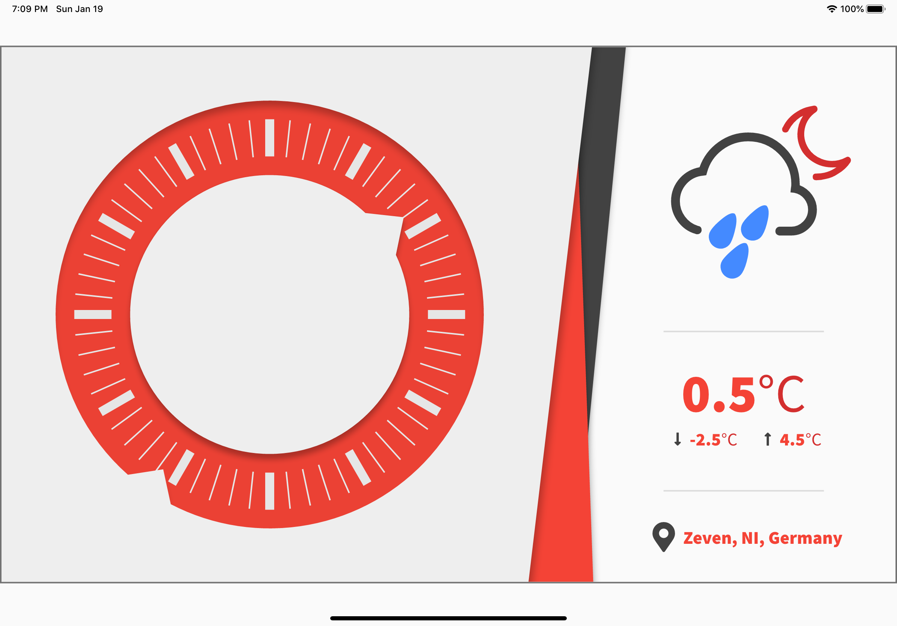
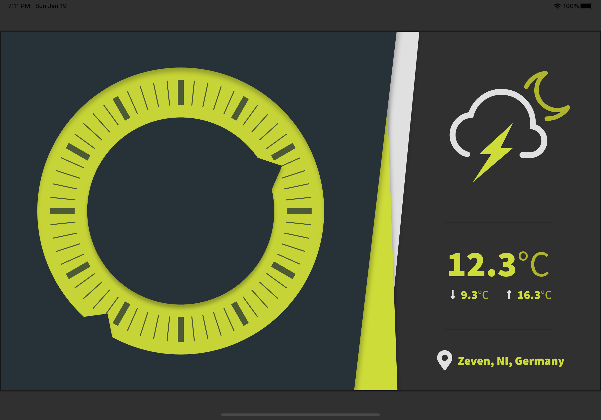

# Ring Clock

This app is my entry for the [flutter clock challenge](https://flutter.dev/clock).
It has a light theme and a dark theme, and displays sample weather and location data.

It makes use of the awesome [Forecast Font](https://webdesignbestfirm.com/forecastfont.html) for displaying the forecast icons.

### Light Theme

### Dark Theme

